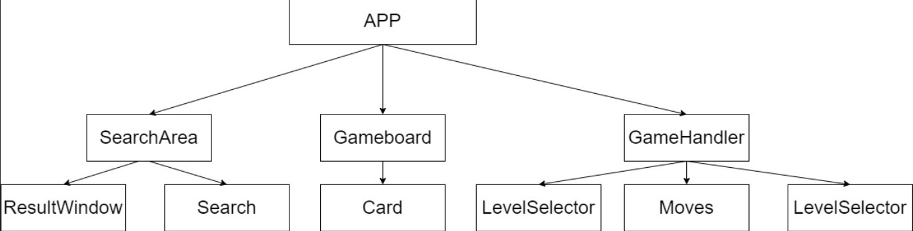

Simple matching game taking in a set of data and turning two elements from the database rows into cards. 

--First Folder: Server

    -The server side is built using Node JS with CRUD operations; Get, GET Single, and Post. 
    
    -The environment is handled inside the dbConn.js file; this file allows the dev to minimize repeated code errors. 
   
    - The project is deployed through Render.com; with the database table and rows respectively through migrate.js and seed.js
    
    - Before running the project look in the package.json for the dependencies and devDependencies to install in the terminal and the scripts to run inside the terminal and Render.

--Second Folder: Client

    
    

    - Game was built using React JS.

    - This is the main library and functionality for the game.
   
    - Before running the project look in the package.json for the dependencies and devDependencies to install in the terminal.
    
    - The project_img folder is holding the wire frame for the project and depicts the parent (App), its three children (GameHandlers, Gameboard, and SearchArea), along with each of their indivdual children.

    
    
    - Parent: App
       
        - Holds all information that is drilled down to multiple children, all critical states, and the initial Fetch data.
        
        - To setup each game the function resetCards() is initially called from the LevelSelector (see LevelSelector), but the state is changed in multiple children.
       
        - The function resetTurn allows the Gameboard to check the two selected cards and check if they match or not and either way move the game to the next turn by increasing the move count and if not match reset the cards to show the back and reset the two cards’ options being held.
       
        - The game was developed with the App having three fields of interest; Child 1; GameHandlers (Objects which support game play) / Child 2; Gameboard / Child 3; SearchArea (to look up the cards that are being shown)
    
    - Child 1: GameHandlers

        - GameHandlers was developed to handle all the functions that support or inform the player.

        - GameHandles the game's title to allow a nice look and feel to the game.

        - GameOver menu; is a conditional method built in when the score and card.length are equal to each other handled inside the Gameboard (see Gameboard). 

            - Once all cards have been matched and disabled the player will be shown the Winner message and the NewGame Button.

            -The NewGame button is stylized with a glow effect and hover abilities

        - LevelSelector manages the difficulty rating of the game. 
        
            -Using a limiter to determine the set number of initial rows to be played with (4, 8, 12, 18, and 28). 
            
            - The other issue was that it would be the same rows every time, so the LevelSelector has a Sort added to allow the database to randomly sort the rows prior to the slice being added and lastly being mapped into a new array. 
            
            - The cards will be duplicated inside the ResetCards function. The cards will be given their index value in the Gameboard when the cards are mapped onto the board.

            - When the difficulty is selected it will also set the PrevCard state as well. When the player selects "New Game", at the end of the game, the game will reset with the last chosen difficulty level and will regenerate that number of cards.

        - Moves: Keeps track of the amount of moves a player makes

        - Score: keeps track of the current score of the game and is a critical piece to allow the end game to be "true".

    - Child 2: Gameboard

        - The Gameboard has one child Card. The Card will generate a random row as a card. 

        - The card will remain flipped either if the player is choosing the two cards to compare against or remain flipped if they match

        - The Gameboard had to run the checks and balances of the games;

            -If the second choice wasn't a match reset turn and add to move counter

            - if both of the cards’ id (from database) matched turn matchFound to true

            - if the cards matched add to the current score, and add to move counter

            - lastly check if the score was equal to the cards.length divided by two.

            - Temporarily disable both cards while the id check was happening. If not equal reactivate and flip the cards. If ids did match remain flipped face up and permanently disable the cards.

    -Child 3: Search Area

        - SearchArea has two children the search and input bar (Search) and the ResultWindow.

        - The Search is a normal search operator and has an auto fill feature that will run if user types case sensitive.

        - The result window will generate the search results allowing the user to view the card’s information.
